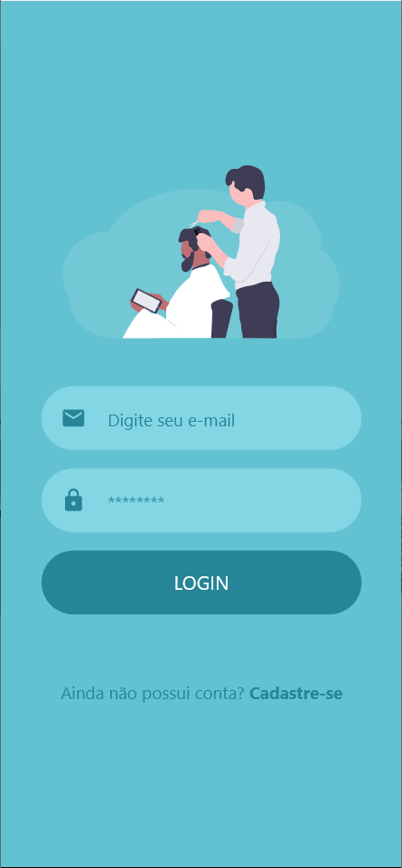
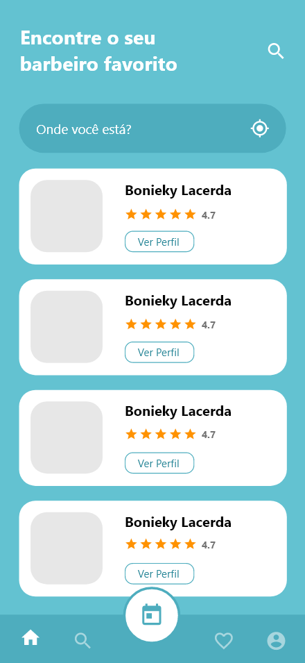
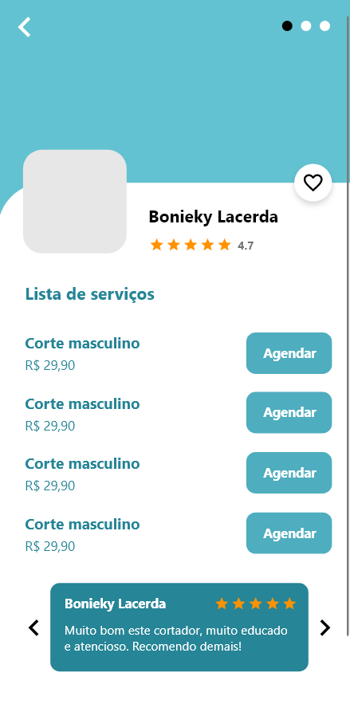
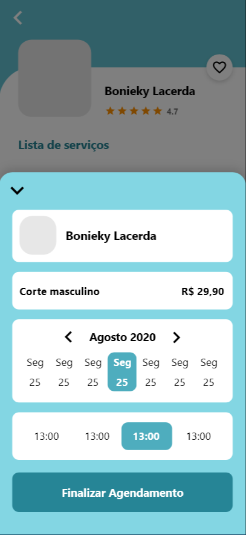
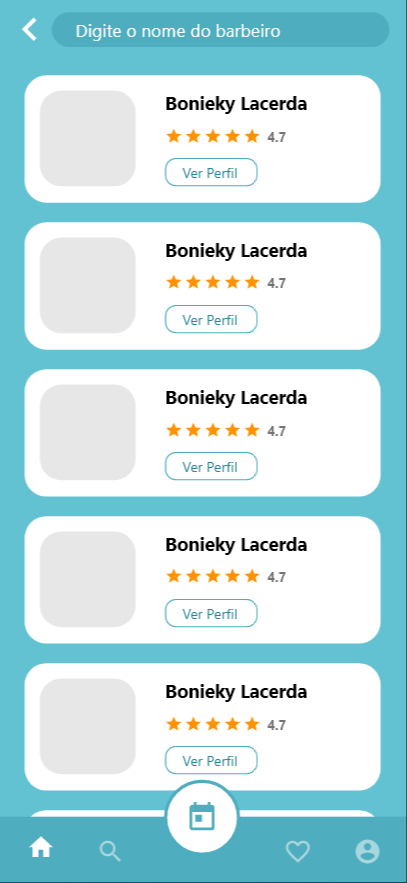
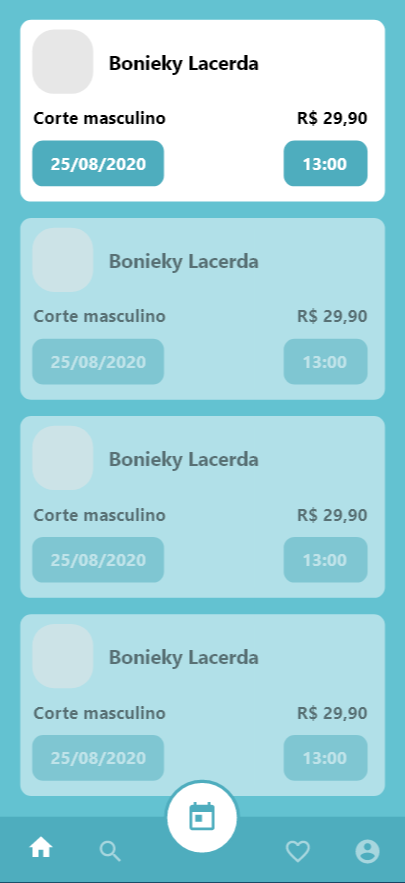

<h1 align="center">:scissors: Devbarber API :scissors:</h1>

O Devscond API se trata de uma API desenvolvida em laravel para ser utilizado no app mobile DevBarber, o mesmo se trata de um sistema de agendamento para barbeiros utilizando geolocalização, digamos que seria o ifood dos barbeiros HAHA.

## :camera: Demonstração

    
    
    
    
    
    

 

# Funcionalidades

 - Unauthorized
 - Login
 - Cadastro
 - logout
 - Refresh token JWT
 - Listar Infomaçãoes do usuario logado
 - Listar Documentos
 - Listar Ocorrencia
 - Adicionar Ocorrencia
 - Adicionar Arquivo da ocorrencia
 - Listar Boletos
 - Listar unidade pelo ID
 - Adicionar pessoas a unidade do ID informado
 - Adicionar veiculos a unidade do ID informado
 - Adicionar pets a unidade do ID informado
 - Remover pessoas a unidade do ID informado
 - Remover veiculos a unidade do ID informado
 - Remover pets a unidade do ID informado
 - Listar Reservas de areas compartilhadas
 - Reserva uma area compartilhada
 - Listar dias desabilitados por padrão de determinada area compartilhada
 - Listar Horarios disponiveis da area compartilada
 - Listar minhas reservas
 - Deletar uma reserva minha pelo ID

---

## 🚀 Tecnologias

Este projeto foi desenvolvido com as seguintes tecnologias:

- ✔️ Laravel

- ✔️ JWT

- ✔️ Routes

- ✔️ Storage

- ✔️ Middlewares

- ✔️ Api Geo loccalização do google

- ✔️ Middlewares

## ⚙ Configuração via Composer

1- Para instalar o Laravel:
> composer global require laravel/installer

2- Para iniciar a aplicação:
> php artisan serve

Feito com 💜 por JOÃO OLIVEIRA 👋 [Veja meu Linkedin](https://www.linkedin.com/in/joao-php/)
 

